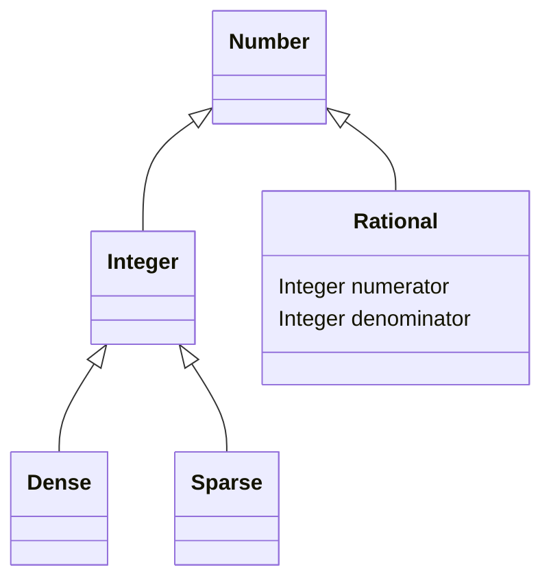

# Calvodax

Calvodax is a calculator, that can represent numbers with unlimited precision.

## Functionality
* Calvodax can read expressions from stdin and evaluate them.
* It can store variables and use them later.
* Basic operations - addition, subtraction, multiplication.
* For integers also division and remainder.
* Functions for rounding, factorial and exponentiation.
* The current state of saved variables can be stored in a human readable file.
* Saved states can be loaded into memory.
* Numbers are stored as two types. Scientific notation (10^n) or normal notation.

### Expresions
* Expresions are expresed in standard notation. For a more complex grammar
  see [Grammar](./Grammar)

#### Example
```
~/calvodax $ ./calvodax
>>> foo = 1 + 3
<<< 4
>>> bar = factorial ( foo )
<<< 24
>>> science = 10e31
<<< 1e32
>>>
>>> science % bar
<<< 16
>>> export calculation
<<< Current variables were saved to /home/user/calvodax/calculation.cldx
>>>
>>> import calculation
<<< Variables loaded from /home/user/calvodax/calcualtion.cldx
```

## Polymorphism
Where does Calvodax use polymorphism:
* Nodes of the abstract syntax tree, while evaluating expressions.
* Number representation different types of number are descendents of an abstract
  Number class.



## Limitations
* Can't use irrational numbers, as they would fill up the whole memory.
* No user defined functions - out of scope for this assignment